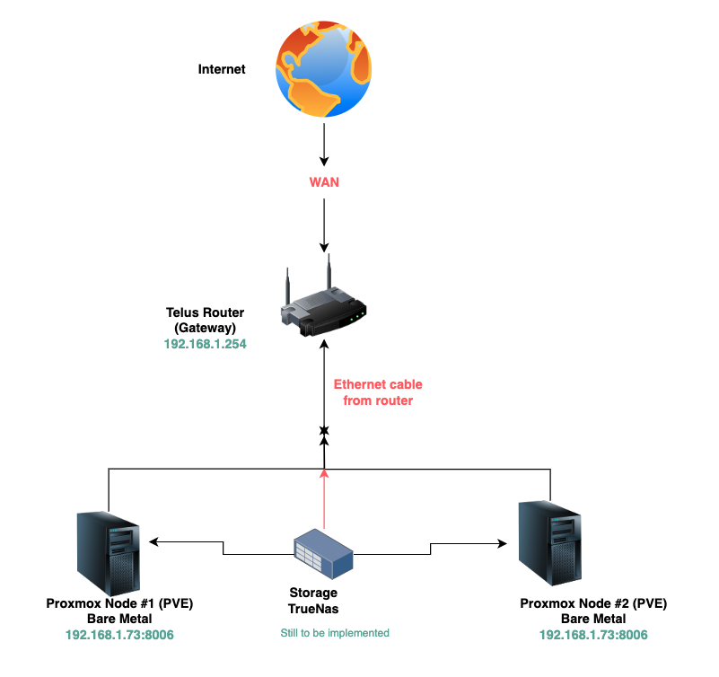

# 🏠 Home-lab Infrastructure

This repository documents my **personal homelab setup** — starting with an old PC upgraded with ~$150 in RAM and SSD, now running Proxmox VE and multiple services.

The goal is to create a **scalable and educational environment** for learning virtualization, DevOps, CI/CD, networking, and storage.

---

## 📖 Table of Contents
1. [Current Infrastructure](#-current-infrastructure)
2. [Services Running](#-services-running)
3. [Networking](#-networking)
4. [Architecture Diagram](#-architecture-diagram)
5. [Coming Soon](#-coming-soon)
6. [Roadmap](#-roadmap)

---

## ✅ Current Infrastructure

### Hardware
- **Server**: Repurposed desktop tower (bare metal Proxmox host)
- **CPU**: Intel i5 (4 cores / 8 threads, VT-x enabled)
- **RAM**: 20 GB DDR4
- **Storage**:
  - 2 TB SSD (VMs & containers)
  - 500 GB HDD (secondary storage / ISOs)
- **Network**: Onboard Gigabit NIC
- **Power**: Standard desktop PSU

### Environment
- **Gateway**: `192.168.1.254` (TELUS Router)
- **Proxmox Node**: `192.168.1.73:8006`
- **Subnet**: `192.168.1.0/24`

---

## 🖥 Services Running

| Service                   | Host / Node                 | Purpose                                  | Status                           |
|---------------------------|-----------------------------|------------------------------------------|----------------------------------|
| **Proxmox VE**            | Bare metal (`192.168.1.73`) | Virtualization platform for VMs and LXCs | ✅ Running                        |
| **Ubuntu Homelab Server** | VM in Proxmox               | Sandbox for Linux projects               | ✅ Running                        |
| **Jenkins**               | VM in Proxmox               | CI/CD pipelines for testing projects     | ✅ Running                        |
| **Sonatype Nexus**        | VM in Proxmox               | Local artifact registry (Maven/Docker)   | ✅ Running                        |
| **WireGuard VPN**         | VM (Proxmox)                | Secure remote access into homelab        | ⚠️ Installed, not yet configured |

---

## 🌐 Networking

- **CIDR Block**: `192.168.1.0/24`
- **Gateway**: `192.168.1.254`
- **Reserved IPs**:
  - `192.168.1.73` → Proxmox node
  - `.74`, `.75` → planned for future nodes
- **DHCP Reservation**: Proxmox MAC reserved in router to avoid conflicts

---

## 🗂 Architecture Diagram

---

## 🔮 Coming Soon

- **TrueNAS** → Centralized NFS/iSCSI storage for VM images, templates, and backups
- **Proxmox Backup Server (PBS)** → VM/LXC backup solution
- **Grafana + Prometheus** → Monitoring & metrics
- **Additional Proxmox Nodes** → Build a 2–3 node cluster for HA and migration
- **WireGuard Configuration** → Access homelab remotely with VPN
- **Kubernetes (K3s)** → Lightweight cluster running inside Proxmox

---

## 🛠 Roadmap

- [x] Build Proxmox host on bare metal
- [x] Deploy Ubuntu VM for projects
- [x] Install Jenkins and Nexus for CI/CD testing
- [x] Install WireGuard (pending config)
- [ ] Add NAS (TrueNAS) for shared storage
- [ ] Deploy Proxmox Backup Server (PBS)
- [ ] Add monitoring stack (Prometheus + Grafana)
- [ ] Add Node #2 for Proxmox clustering
- [ ] Configure WireGuard for remote access
- [ ] Deploy Kubernetes on top of Proxmox

---

## 📌 Takeaway
This homelab shows how far you can go with **minimal investment** (~$150 in upgrades to an old PC).  
It’s the base for **DevOps learning, automation testing, and infrastructure projects**.

As the setup grows, new nodes, storage, and monitoring will be added — moving toward a **production-like cluster environment**.

